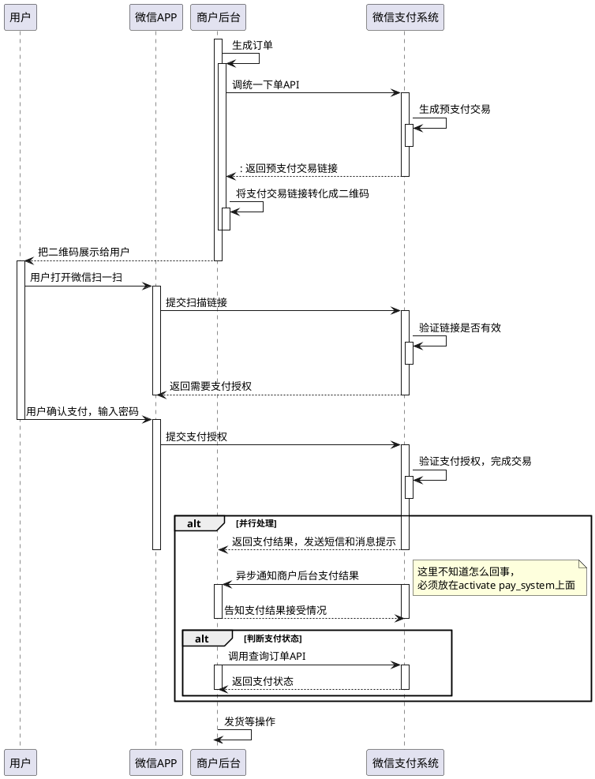

[官网已经很详细了，还自带中文，很容易看懂](https://plantuml.com/)

### 时序图

```puml
@startuml
participant "用户" as user
participant "微信APP" as app
participant "商户后台" as background
participant "微信支付系统" as pay_system
actor user
entity app
entity background
entity pay_system

activate background
    background->background: 生成订单
    activate background
        background->pay_system: 调统一下单API
            activate pay_system
                pay_system->pay_system: 生成预支付交易
                activate pay_system
                deactivate pay_system
                return: 返回预支付交易链接
            deactivate pay_system
        background->background: 将支付交易链接转化成二维码
        activate background
        deactivate background
    deactivate background
    background-->user: 把二维码展示给用户
deactivate background

activate user
    user->app: 用户打开微信扫一扫
    activate app
        app->pay_system: 提交扫描链接
        activate pay_system
            pay_system->pay_system: 验证链接是否有效
            activate pay_system
            deactivate pay_system
            return 返回需要支付授权
        deactivate pay_system
    deactivate app
    user->app: 用户确认支付，输入密码
deactivate user

activate app
    app->pay_system: 提交支付授权
    activate pay_system
        pay_system->pay_system: 验证支付授权，完成交易
        activate pay_system
        deactivate pay_system
        alt 并行处理
            pay_system-->background: 返回支付结果，发送短信和消息提示
    deactivate pay_system
deactivate app

            pay_system->background: 异步通知商户后台支付结果
            activate pay_system
            activate background
            note right: 这里不知道怎么回事，\n必须放在activate pay_system上面
            background-->pay_system: 告知支付结果接受情况
            deactivate background
            deactivate pay_system

            alt 判断支付状态
            background->pay_system:调用查询订单API
            activate background
                activate pay_system
                    return 返回支付状态
                deactivate background
            deactivate background
            end alt
        end alt

activate background
background->background: 发货等操作
deactivate background
@enduml
```

